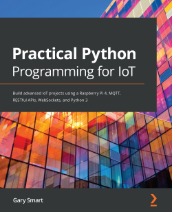

# Practical Python Programming for IoT

The code in this repository accompanies the Packt Book Practical Python Programming for IoT, published by Packt.

[Table of Contents (PDF)](./TableOfContents1stEd.pdf)

--- 

## Purchasing Practical Python Programming for IoT

Practical Python Programming for IoT is available through Packt and Amazon.

* [Amazon US](https://www.amazon.com/Practical-Python-Programming-IoT-WebSockets/dp/1838982469/ref=sr_1_1)
* [Amazon AU](https://www.amazon.com.au/Practical-Python-Programming-IoT-WebSockets-ebook/dp/B08K3MD5Z1)
* [Packt](https://www.packtpub.com/product/practical-python-programming-for-iot/9781838982461)

--- 

## Repository Contents

## [Errata](errata) - Corrections and clarifications to the published content

## [Chapter 1](chapter01) - Setting Up Your Development Environment

## [Chapter 2](chapter02) - Introduction to Python and IoT

## [Chapter 3](chapter03) - RESTFul APIs and Web Socket Services with Flask

## [Chapter 4](chapter04) - Distributed Systems with Python and MQTT

## [Chapter 5](chapter05) - Connecting Your Raspberry Pi to the Physical World

## [Chapter 6](chapter06) - Electronics 101 for the Software Engineer

## [Chapter 7](chapter07) - Switching Things On and Off

## [Chapter 8](chapter08) - Lights, Indicators and Displaying Information

## [Chapter 9](chapter09) - Measuring Temperature, Humidity and Moisture

## [Chapter 10](chapter10) - Movement with Motors, Servos and Steppers

## [Chapter 11](chapter11) - Measuring Distance and Detecting Movement

## [Chapter 12](chapter12) - Advanced IoT Programming Concepts - Event-Loops, Threads, PubSub &amp; AsyncIO

## [Chapter 13](chapter13) - IoT and Automation Platforms

## [Chapter 14](chapter14) - Tying it Altogether - An IoT Christmas Tree

