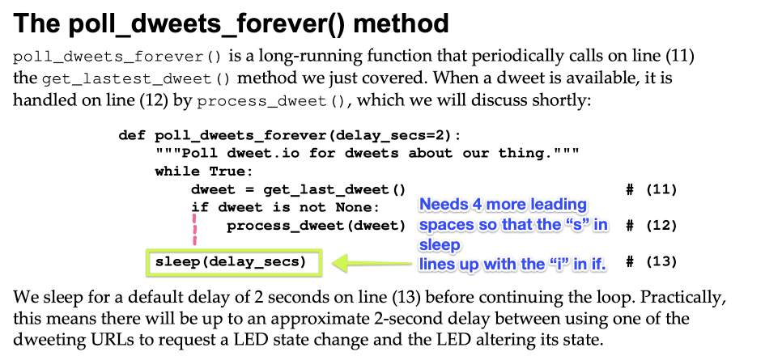
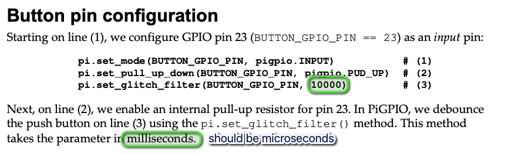

# Chapter Errata

This page contains corrections and clarifications to the content found in the published book.

All code corrections listed on this page have been corrected in this repository.

## Chapter 2

### Page 43 - Breadboard Examples

**Incorrect Text**

The 3rd bullet point reads _"A2 is not electrically connected to B2 (they don't share the same row)."_. This statement is incorrect because A2 _is_ electrically connected to B2 because they do share the same row.

**Corrected Text**

The 3rd bullet point should be _"A2 is not electrically connected to **A3** (they don't share the same row)."_.


### Page 72 - poll_dweets_forever() function

There is a 4 space indentation missing in the code example for the function `poll_dweets_forever()` at line 13. The effect of this means the statement `sleep(delay_secs)` is outside the `while` block and the loop never incurs the delay. 

This error does not affect a readers ability to successfully run the example, but it does make the following paragraph describing line 13 practically incorrect as the code does not incur the 2-second delay mentioned.

The following image illustrates the issue.



### Page 64 - Responding to a button press with PiGPIO

Under the heading **Button pin configuration**, we see a snippet of code from the file `chapter02/button_gpiozero.py`

At line 3 `set_glitch_filter` has the parameter 10000, which is the debounce time measured in __microseconds__.

The proceeding paragraph states the value is in __milliseconds__, which is incorrect.



In this example, the timeout is therefore 10000 / 1000000 = 0.01 seconds

This difference in timing value is not expected to affect the reader's ability to complete the exercise. However, should the example behave erratically when the button is pressed, the reader should change the parameter at line 3 from `10000` to `100000` to make the debounce time 0.1 seconds. The corrected line will therefore be:

```
pi.set_glitch_filter(BUTTON_GPIO_PIN, 100000)         # (3)
```

Also note that earlier in the chapter on Page 63, we see a code example from file `chapter02/button_gpiozero.py` using a debounce time of 0.1 seconds. The error on Page 64 and in file `chapter02/button_gpiozero.py` mean that the GPIOZero and PiGPIO examples are not strictly identical, although from an illustrative perspective for the purposes of the chapter they can be considered functionally identical.
